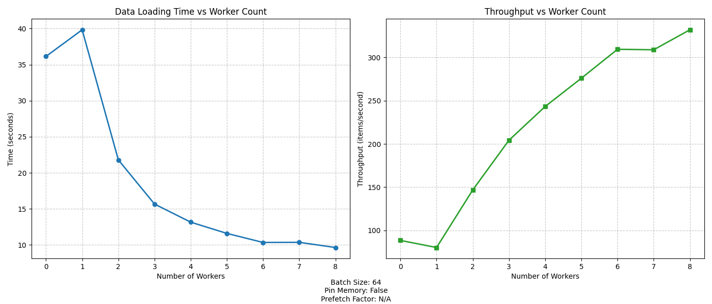

# PyTorch DataLoader Performance Analysis

## Benchmark Results Summary

The benchmark test was conducted with the following configuration:
- **Batch Size**: 64
- **Number of Batches**: 50
- **Pin Memory**: False
- **Prefetch Factor**: 2 (when applicable)
- **Total Items**: 3,200 (64 × 50)

### Results Table

| Workers | Duration (s) | Throughput (items/s) |
|---------|-------------:|---------------------:|
| 0       | 36.14        | 88.55                |
| 1       | 39.83        | 80.34                |
| 2       | 21.79        | 146.84               |
| 3       | 15.67        | 204.23               |
| 4       | 13.16        | 243.19               |
| 5       | 11.60        | 275.86               |
| 6       | 10.35        | 309.32               |
| 7       | 10.36        | 308.75               |
| 8       | 9.64         | 331.83               |

**Optimal Configuration**: 8 workers (9.64 seconds, 331.83 items/second)

## Graph Analysis

The benchmark results are visualized in two complementary graphs:

### Graph 1: Data Loading Time vs Worker Count



This graph shows how the total processing time decreases as the number of worker processes increases. Key observations:

1. **Initial Performance Dip**: When moving from 0 workers to 1 worker, the performance actually worsens, with time increasing from ~36 seconds to ~40 seconds.
   
2. **Rapid Improvement**: From 1 to 5 workers, there's a dramatic improvement in performance, with loading time dropping from ~40 seconds to ~11.6 seconds.

3. **Diminishing Returns**: After 5-6 workers, the improvement in loading time becomes minimal, indicating a point of diminishing returns.

4. **Plateau**: Between 6-8 workers, the curve begins to flatten, suggesting we're approaching the system's physical limit or reaching other bottlenecks.

### Graph 2: Throughput vs Worker Count


This graph displays the inverse relationship by showing items processed per second. Key observations:

1. **Initial Throughput Drop**: Consistent with the first graph, throughput decreases when moving from 0 to 1 worker (from ~88 to ~80 items/second).

2. **Exponential Improvement**: From 1 to 6 workers, there's an exponential growth in throughput, nearly quadrupling from ~80 to ~309 items/second.

3. **Plateau and Final Boost**: The throughput stabilizes between 6-7 workers (~309 items/second) before making a final improvement at 8 workers (reaching ~332 items/second).

## Analysis of Results

### Why Does a Single Worker Perform Worse Than No Workers?

This counter-intuitive result is a classic example of process overhead outweighing benefits:

1. **Overhead of Multiprocessing**: When using num_workers=1, PyTorch creates a separate worker process which requires:
   - Process initialization overhead
   - Inter-process communication (IPC) overhead
   - Queue management for transferring data

2. **Sequential Operation**: With 0 workers, the data loading happens in the main process, eliminating the IPC overhead. Although this is still sequential, it avoids the communication penalties.

3. **Memory Copying**: With workers, data must be copied between processes, which is slower than in-process operations when parallelism isn't effectively utilized.

### Why Do Multiple Workers Improve Performance?

The dramatic improvement with multiple workers demonstrates the power of parallelism in I/O-bound operations:

1. **True Parallelism**: Multiple worker processes can truly operate in parallel, especially on multi-core systems.

2. **Overlapping Operations**: While one worker is performing the I/O-intensive loading, others can be processing different batches.

3. **Prefetching**: With prefetch_factor=2, each worker prepares multiple batches ahead of time, ensuring the training loop always has data ready.

4. **Distribution of Overhead**: The fixed costs of process management get amortized across more useful work.

### Understanding the Diminishing Returns

The flattening curve after 6-7 workers indicates several limiting factors:

1. **Hardware Limitations**: The benchmark system likely has 8 physical CPU cores. After utilizing all available cores, adding more workers doesn't provide true additional parallelism.

2. **Resource Contention**: Too many workers can lead to competition for resources like CPU cache, memory bandwidth, and disk I/O.

3. **Overhead Growth**: Each additional worker adds management overhead, which eventually counterbalances the parallelism benefits.

4. **Bottleneck Shifting**: At some point, the bottleneck may shift from data loading to another part of the system (like the simulated processing step).

## How PyTorch DataLoader Works Under the Hood

To fully understand these results, it's helpful to know how PyTorch's DataLoader functions:

### Architecture of PyTorch DataLoader

1. **Worker Processes**: When `num_workers > 0`, DataLoader spawns separate worker processes to load data in parallel.

2. **Queue System**: Communication between workers and the main process happens through queue mechanisms:
   - `worker_result_queue`: Workers place loaded batches here
   - `index_queue`: Main process sends indices to be fetched here
   - `worker_control_queue`: Used for control signals between processes

3. **Data Flow**:
   ```
   Dataset.__getitem__() -> Worker Process -> Queue -> Main Process -> Training Loop
   ```

4. **Prefetching Mechanism**: The `prefetch_factor` determines how many samples per worker to prefetch. This helps ensure data is ready when needed by the training loop.

### The Impact of `pin_memory=False`

In these benchmarks, `pin_memory` was set to `False`, which affects how memory is handled:

1. **Non-Pinned Memory**: Regular system memory that is subject to paging by the OS.

2. **Memory Transfers**: Without pinned memory, transfers to GPU (if used) would be slower due to potential paging operations.

3. **Performance Impact**: For CPU-only workloads (like this benchmark), the impact is minimal, but for GPU training, enabling `pin_memory=True` can provide significant speedups.

## Practical Recommendations

Based on these benchmark results, here are practical recommendations for optimizing DataLoader performance:

1. **Optimal Worker Count**: Set `num_workers` to match the number of available CPU cores (8 in this case). Using `num_workers=multiprocessing.cpu_count()` is a good starting point.

2. **Avoid Single Worker**: Either use no workers (0) or multiple workers (2+), but avoid using exactly one worker as it often performs worse than sequential loading.

3. **Batch Size Consideration**: Larger batch sizes may benefit more from parallelism, as each worker has more substantial work to do, minimizing the impact of overhead.

4. **Enable Pin Memory for GPU**: When using GPU, always set `pin_memory=True` for better CPU-to-GPU transfer performance.

5. **Adjust Prefetch Factor**: For datasets with heavy preprocessing, increasing the prefetch factor (typically 2-4) can help keep the pipeline full.

6. **Monitor System Resources**: During training, monitor CPU, memory, and I/O usage to identify potential bottlenecks and adjust worker count accordingly.

## Conclusion

The benchmark results clearly demonstrate that parallel data loading using multiple worker processes can dramatically improve data pipeline performance, with up to 3.7x speedup compared to sequential loading. However, careful tuning is necessary as simply adding more workers doesn't always improve performance linearly and can sometimes even degrade it (as seen with the single worker case).

The optimal configuration depends on the specific hardware, dataset characteristics, and the balance between data loading and model computation phases. Regular benchmarking with different configurations is recommended as datasets and hardware environments change.

For this specific simulation with its 10ms artificial delay per item, 8 workers proved optimal, achieving a throughput of ~332 items/second. This configuration most effectively balances parallelism benefits against the overhead costs of managing multiple worker processes.