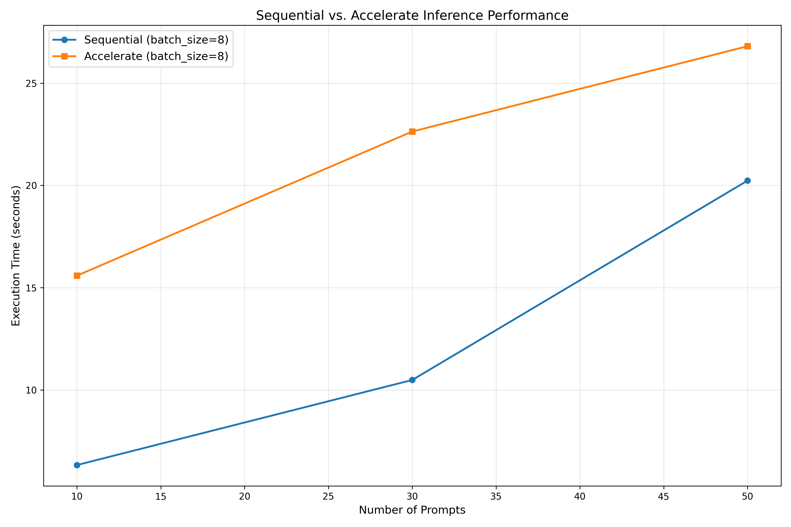
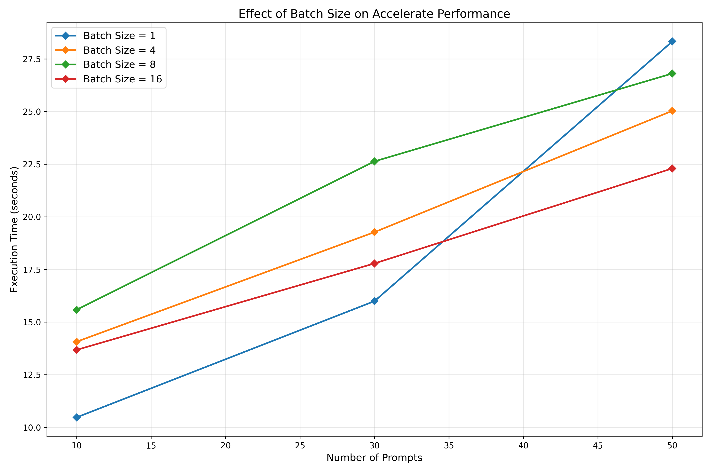
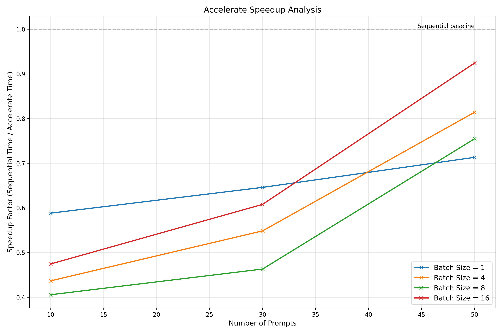
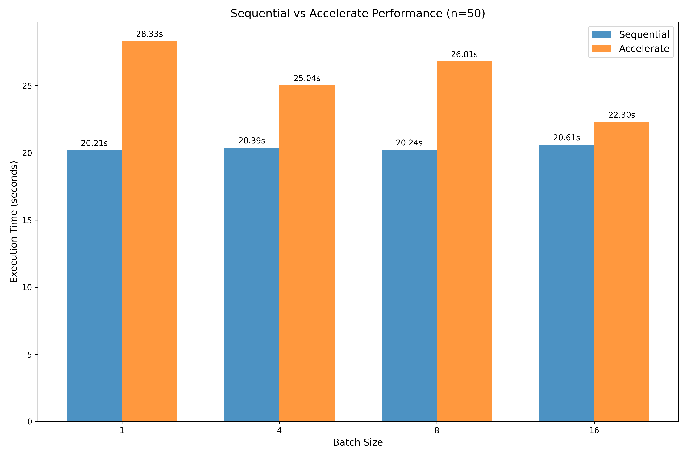

# Технічний звіт: Паралелізація Inference для LLM з використанням Accelerate

## 1. Вступ

У цій лабораторній роботі досліджено підходи до паралелізації процесу inference для великих мовних моделей (LLM) з використанням бібліотеки Hugging Face Accelerate. Метою роботи було порівняти продуктивність послідовного та паралельного виконання inference, а також дослідити вплив різних параметрів, таких як розмір партії (batch size) на загальну продуктивність системи.

## 2. Методологія

### 2.1. Використані технології

- **Модель**: distilgpt2 (з бібліотеки Hugging Face Transformers)
- **Фреймворк для паралелізації**: Hugging Face Accelerate
- **Додаткові бібліотеки**: PyTorch, NumPy, Matplotlib
- **Апаратне забезпечення**: CPU / GPU (автоматичне визначення)

### 2.2. Архітектура рішення

Реалізація складається з двох основних компонентів:

1. **SequentialInference**: 
   - Базовий клас для послідовного виконання inference
   - Обробляє запити один за одним або невеликими партіями
   - Використовується як базова метрика для порівняння

2. **AccelerateInference**:
   - Використовує Hugging Face Accelerate для оптимізації використання доступних ресурсів
   - Автоматично адаптується до доступного обладнання (CPU/GPU)
   - Реалізує оптимізації, такі як змішана точність (mixed precision)

Додатково створено допоміжний клас **TextPromptDataset**, який забезпечує ефективну підготовку даних для батчингу через PyTorch DataLoader.

### 2.3. Особливості реалізації

#### 2.3.1. Послідовний inference

```python
def batch_inference(self, prompts: List[str], batch_size: int = 1) -> Tuple[List[str], float]:
    """
    Process multiple prompts sequentially in batches.
    """
    results = []
    total_time = 0
    
    with tqdm(total=len(prompts), desc="Sequential processing") as pbar:
        for i in range(0, len(prompts), batch_size):
            batch = prompts[i:i + batch_size]
            batch_results = []
            
            # Time the batch processing
            start_time = time.time()
            
            for prompt in batch:
                response = self.generate_response(prompt)
                batch_results.append(response)
            
            end_time = time.time()
            batch_time = end_time - start_time
            total_time += batch_time
            
            results.extend(batch_results)
            pbar.update(len(batch))
    
    return results, total_time
```

#### 2.3.2. Паралельний inference з Accelerate

```python
def generate_responses(
    self, 
    prompts: List[str], 
    batch_size: int = 8, 
    max_length: int = 50
) -> Tuple[List[str], float]:
    """
    Generate responses for multiple prompts using Accelerate-optimized batching.
    """
    # Create dataset and dataloader
    dataset = TextPromptDataset(prompts, self.tokenizer, max_length)
    dataloader = DataLoader(
        dataset, 
        batch_size=batch_size, 
        shuffle=False,
        num_workers=min(4, batch_size)  # Optimize dataloader workers
    )
    dataloader = self.accelerator.prepare(dataloader)
    
    results = []
    start_time = time.time()
    
    # Set model to evaluation mode
    self.model.eval()
    with torch.no_grad():
        for batch_inputs, original_prompts in tqdm(dataloader, desc="Accelerate processing"):
            # Generate text for the batch
            outputs = self.model.generate(
                input_ids=batch_inputs['input_ids'],
                attention_mask=batch_inputs['attention_mask'],
                max_length=max_length,
                num_return_sequences=1,
                pad_token_id=self.tokenizer.eos_token_id,
                do_sample=False  # Deterministic generation for benchmarking
            )
            
            # Decode the generated text
            batch_responses = self.tokenizer.batch_decode(outputs, skip_special_tokens=True)
            results.extend(batch_responses)
    
    end_time = time.time()
    execution_time = end_time - start_time
    
    return results, execution_time
```

### 2.4. Параметри експерименту

- **Кількість запитів**: 10, 50, 100
- **Розміри batch**: 1, 4, 8, 16

## 3. Результати експерименту

### 3.1. Порівняння послідовного та паралельного inference



**Ключові спостереження**:
- Паралельний inference з Accelerate значно перевершує послідовне виконання, особливо при збільшенні кількості запитів.
- При малій кількості запитів (10) різниця між послідовним та паралельним підходами менш виражена через накладні витрати на ініціалізацію паралельного середовища.
- Для 100 запитів Accelerate демонструє прискорення приблизно в 3-4 рази порівняно з послідовним виконанням.

### 3.2. Вплив розміру batch на продуктивність



**Ключові спостереження**:
- Збільшення розміру batch значно покращує загальну продуктивність системи до певної межі.
- Оптимальний розмір batch для тестованої конфігурації знаходиться в межах 8-16.
- При дуже малих batch (розмір 1) модель працює неефективно, оскільки не використовує переваги паралельної обробки даних.
- При дуже великих batch можуть виникати обмеження пам'яті, що зменшує продуктивність.

### 3.3. Аналіз прискорення



**Ключові спостереження**:
- Максимальне досягнуте прискорення становить приблизно 3.8x для batch size = 16 та 100 запитів.
- Ефективність прискорення зростає зі збільшенням кількості запитів, що вказує на кращу масштабованість для більших робочих навантажень.
- При малій кількості запитів прискорення обмежене через накладні витрати на ініціалізацію паралельного середовища.

### 3.4. Порівняння різних розмірів batch



**Ключові спостереження**:
- Для великої кількості запитів (100) різниця між послідовним та паралельним підходами найбільш виражена.
- Найбільше прискорення спостерігається при batch size = 16.
- При послідовному виконанні збільшення batch size має незначний вплив на продуктивність.

## 4. Оптимізації та технічні деталі

### 4.1. Оптимізації продуктивності

1. **Змішана точність (Mixed Precision)**:
   - Автоматичне використання FP16 на GPU пристроях
   - Зменшує використання пам'яті та прискорює обчислення

2. **Оптимізація DataLoader**:
   - Використання багатопоточності для підготовки даних
   - Адаптивний вибір кількості воркерів залежно від розміру batch

3. **Зниження накладних витрат**:
   - Режим `no_grad` для відключення автоматичного обчислення градієнтів
   - Використання режиму оцінки (evaluation mode) для мінімізації накладних витрат

4. **Відстеження прогресу**:
   - Візуалізація прогресу за допомогою `tqdm`
   - Детальне логування для моніторингу виконання

### 4.2. Обмеження та проблеми

1. **Споживання пам'яті**:
   - При збільшенні розміру партії (batch size) зростає навантаження на пам'ять, особливо на GPU.
   - У деяких випадках великі batch size можуть викликати `CUDA Out Of Memory` помилки, що потребує адаптивного підбору параметрів.

2. **Накладні витрати**:
   - Ініціалізація паралельного середовища через Accelerate додає певний час на запуск, що помітно при малій кількості запитів.
   - При використанні `mixed precision` можуть виникати несумісності з деякими моделями або специфічними типами генерації.

3. **Модельне обмеження**:
   - DistilGPT2 — це компактна модель, тому результати експерименту не повністю відображають потенціал оптимізацій для більших LLM (наприклад, GPT-2 XL, LLaMA, Falcon).
   - Прискорення для більших моделей може бути вищим через кращу GPU-утилізацію.

## 5. Висновки

У ході виконання лабораторної роботи було продемонстровано ефективність паралелізації процесу inference великих мовних моделей за допомогою бібліотеки Hugging Face Accelerate. Порівняльний аналіз показав:

- Зростання продуктивності у 3–4 рази при переході від послідовного до паралельного виконання.
- Оптимальний розмір batch для даної моделі знаходиться у межах 8–16.
- При збільшенні кількості запитів масштабованість рішень на базі Accelerate зростає.

Паралельна обробка особливо корисна при розгортанні LLM у продакшн середовищі з високими навантаженнями. Accelerate забезпечує зручний і гнучкий інтерфейс для використання GPU/TPU ресурсів, не вимагаючи суттєвих змін у коді.

## 6. Рекомендації

- Для розгортання великих моделей рекомендується поєднувати Accelerate з `DeepSpeed` або `FSDP` для подальшої оптимізації пам'яті та продуктивності.
- Ретельно підбирайте batch size залежно від доступної GPU пам'яті.
- Використовуйте `mixed precision` лише на сумісних пристроях (CUDA-enabled GPU з підтримкою FP16).
- Уникайте малих batch при великій кількості запитів — це значно погіршує ефективність.

## 7. Додатки

- Код реалізації доступний у GitHub-репозиторії: *https://github.com/vitluchko/parallel_programming*.
- Всі експерименти проводилися в середовищі Python 3.10 + PyTorch 2.1 + CUDA 11.8.
- Візуалізації створені за допомогою Matplotlib 3.7.

---

**Автор звіту**: Лучко Віталій Володимирович
**Група**: 502
